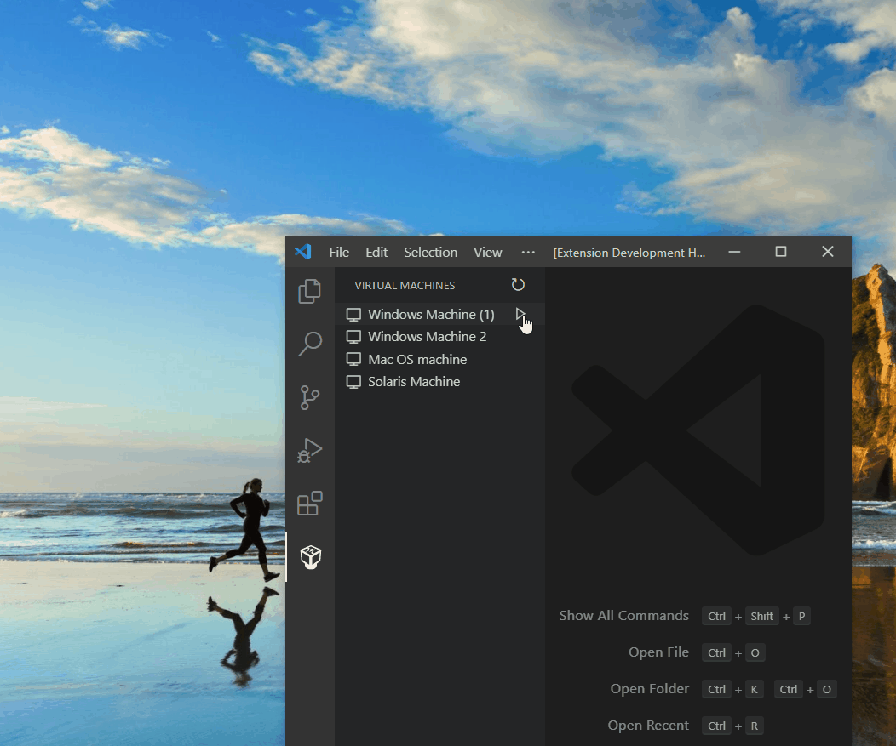
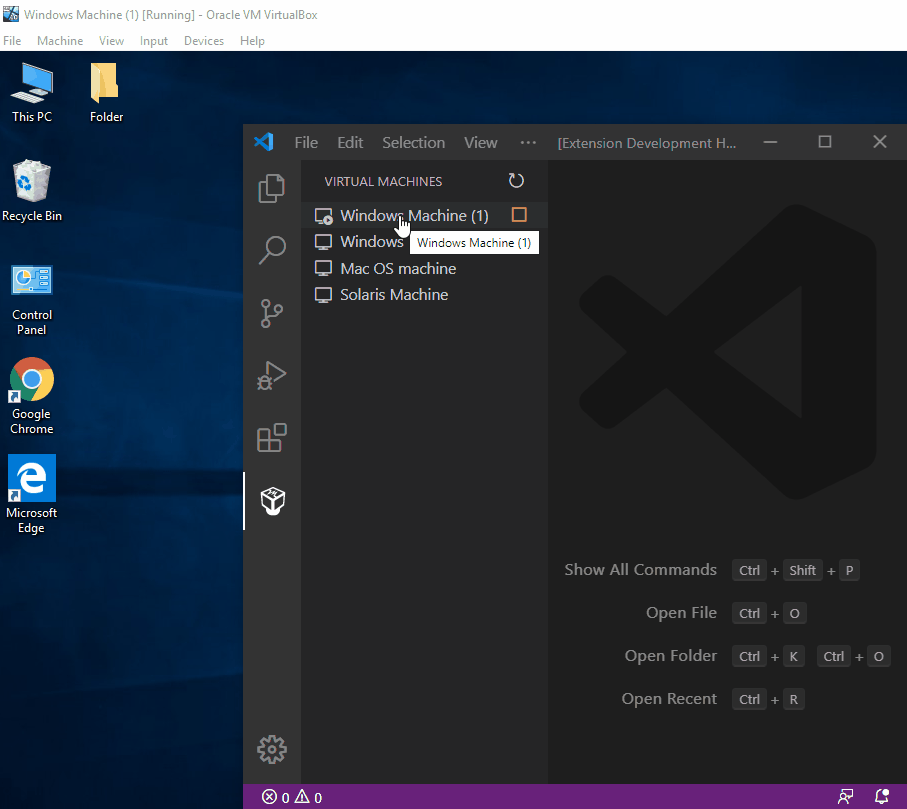

# [Virtual Box extension](https://marketplace.visualstudio.com/items?itemName=acherkashin.virtualbox-extension)

The extension aim is to decrease your switching between different windows and allow you to control your Virtual Machines right from the Visual Studio Code activity bar.

## Installation

1. Download and install the [Virtual Box extension](https://marketplace.visualstudio.com/items?itemName=acherkashin.virtualbox-extension) for Visual Studio Code.

2. Once complete, you'll see a Virtual Machine icon in the Activity Bar.
> If your activity bar is hidden, you won't be able to access the extension. Show the Activity Bar by clicking View > Appearance > Show Activity Bar

## Features

- Start the Virtual Machine in normal or headless mode.

- Stop the Virtual Machine saving its state or doing a normal shutdown.

### Remote into Virtual Machine via SSH

- Use [Visual Studio Code Remote - SSH](https://marketplace.visualstudio.com/items?itemName=ms-vscode-remote.remote-ssh) to seamlessly connect to your Virtual Machine from Visual Studio Code.

## Requirements

- Virtual Box

## License

[MIT](LICENSE)